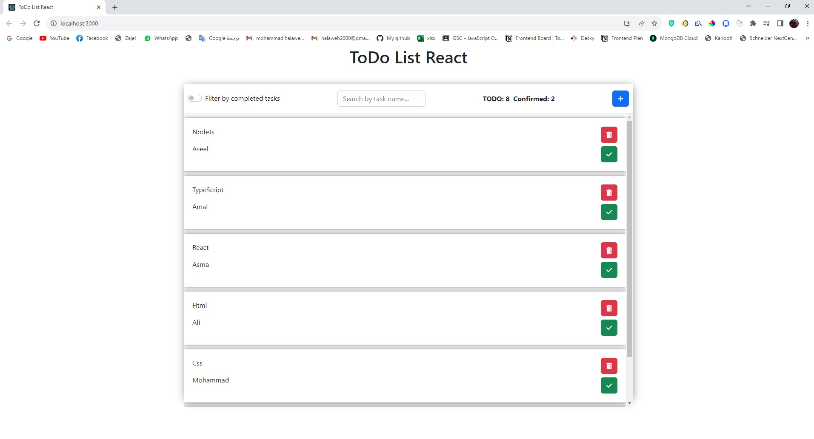
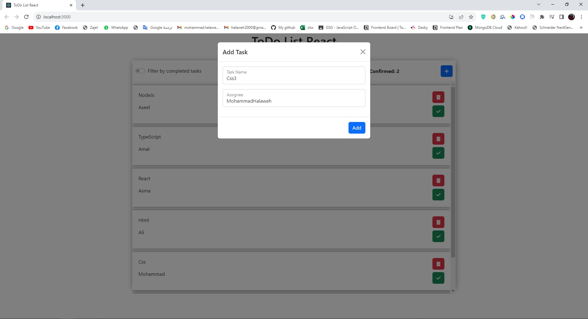
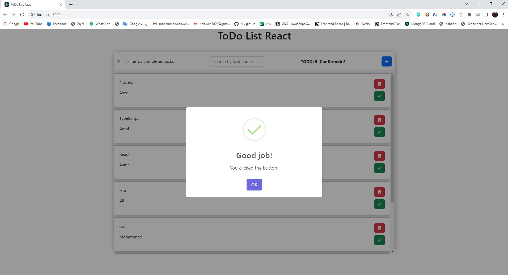
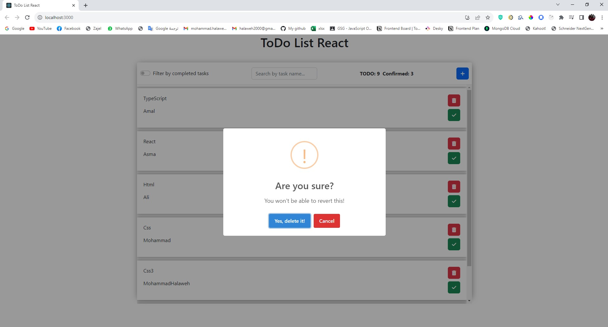
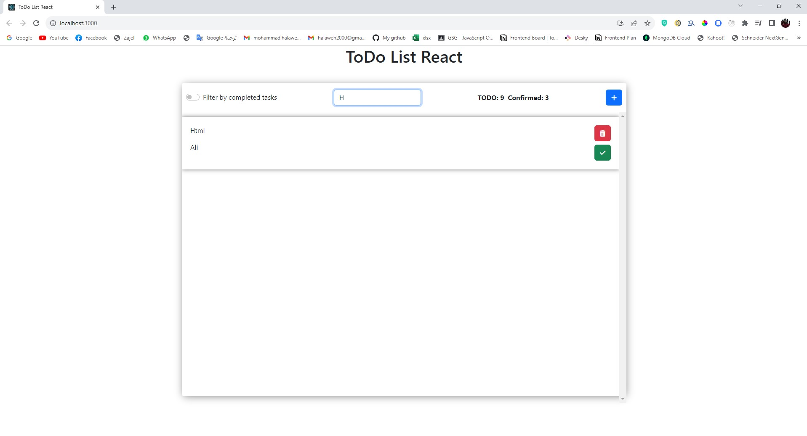

# ToDoList-Typescript

Features:

- Add new to do.
- Delete to do.
- Mark to do as done.
- Count number of to dos in footer.
- Delete to do confirmation.
- Search for to do.
- Edit to do.
- Data should be stored in the browser so when we refresh we don't lose the data.

Tools :
#Typescript, #NodeJs, #mongodb, #html5, #css3, #bootstrap.

## Screenshots

